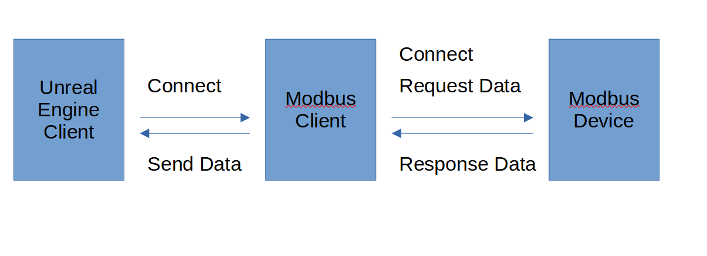

# UnrealEngineModbusSolution

## Purpose
This document describes how to handle communication between Unreal Engine and Modbus devices.

## Solution
Use Python to communicate with the Modbus device and send the received data to the Unreal Engine Client via TCP/IP.

## Required  Python Packages
TODO  
Please refer to the `requirements.txt` file for the list of packages that need to be installed.

## Required Unreal Engine Plugins
[TCP Socket Plugin Markplace Link](https://www.fab.com/listings/48db4522-8a05-4b91-bcf8-4217a698339b)   
[TCP Socket Plugin Github Link](https://github.com/CodeSpartan/UE4TcpSocketPlugin)  
[Varest Markplace Link](https://www.fab.com/listings/2e86baee-b80c-4dc6-acda-4125d9e9a452)  
[Varest Github Link](https://github.com/ufna/VaRest)  

## Examples

### Modbus RTU Example  
Refer to `RTU_Modbus_Client.py`

### Modbus TCP/IP Example  
TODO  
Refer to `TCP_Modbus_Client.py`

## Modbus Client Communication Architecture
